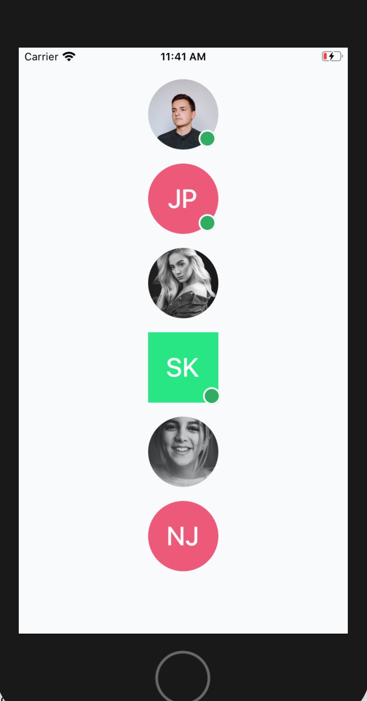

[](http://makeapullrequest.com)


# react-native-user-avatar

A react native user avatar component with progressive loading and text fallback support.

### Screenshots

|                    iOS Screenshot                    |                      Android Screenshot                       |
| :--------------------------------------------------: | :-----------------------------------------------------------: |
|  |  |

### Installation

```sh
npm install @muhzi/react-native-user-avatar
#OR
yarn add @muhzi/react-native-user-avatar
```

### How to use?

```js
import UserAvatar from "@muhzi/react-native-user-avatar";
```

Simply place a `<UserAvatar/>` component.

```js
<UserAvatar userName="John Samuel" backgroundColor="#0be881" />
```

### Props

<table class="table">
<thead><tr>
  <th>Name</th><th>Default</th><th>Type</th><th>Description</th>
</tr></thead>
<tbody>
  <tr><td>userName</td>
    <td> - </td>
    <td> String </td>
    <td>The user name that will be used to compute user initial name.</td></tr>
  <tr><td>initialName</td>
    <td> - </td>
    <td> String </td>
    <td>Force the displayed initials by overriding the computed ones.</td></tr>
  <tr><td>src</td>
    <td> - </td>
    <td> String </td>
    <td>Path of image.</td></tr>
  <tr><td>active</td>
    <td> false </td>
    <td> Boolean </td>
    <td>Whether the user is active or not.(Show active circle around avatar)</td></tr>
  <tr><td>textColor</td>
    <td> #FFFF </td>
    <td> String </td>
    <td>The font color used to render the user initials</td></tr>
    <tr><td>activeCircleColor</td>
    <td> #27ae60 </td>
    <td> String </td>
    <td>Background color active circle</td></tr>
  <tr><td>size</td>
    <td> 64 </td>
    <td> Number </td>
    <td>The avatar size</td></tr>
  <tr><td>rounded</td>
    <td> true </td>
     <td> Boolean </td>
    <td>True if the avatar must be rounded.</td></tr>
     <tr><td>loaderColor</td>
    <td> #aaa69d </td>
    <td> String </td>
    <td>The color of loader</td></tr>
     <tr><td>backgroundColor</td>
    <td> - </td>
    <td> String </td>
    <td>The avatar background color to use if no image is provided</td></tr>
    <tr><td>backgroundColors</td>
    <td> ['#575fcf', '#ef5777', '#0be881'] </td>
    <td> Array </td>
    <td>Array of background colors to choose from, if no background color is specified</td></tr>
   </tbody>
</table>

### Author

[Muhsin K](https://muhzi.com/)

### License

[MIT](./LICENSE)
